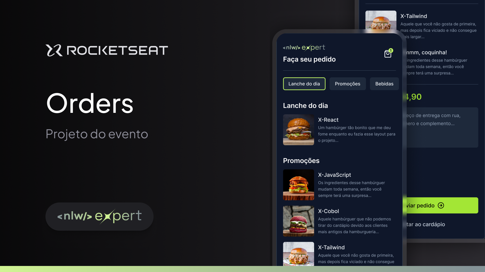

<h1 align="center">Welcome to NLW Expert React Native Orders project 👋</h1>
<p>
  
  
  
  <a href="https://github.com/juliocslima/ignite-lab-reactjs" target="_blank">
    
  </a>
  <a href="https://github.com/kefranabg/readme-md-generator/graphs/commit-activity" target="_blank">
    
  </a>
  <a href="https://github.com/juliocslima/nlw-expert-notes/blob/main/LICENSE" target="_blank">
    
  </a>
</p>

# NLW Expert React Native - Orders

> Este projeto foi resultado do evento NLW Expert React Native promovido pela Rocketseat, onde criamos uma aplicativo de pedidos para uma lanchonete



### 🏠 [Homepage](https://github.com/juliocslima/nlw-expert-react-native)

## Prerequisites

- npm >=9.6.7
- node >=18.12.0
- expo >= 50.0.6

## Install

```sh
npm install
```

## Usage

```sh
npx expo start
```

## Author

👤 **Julio Lima**

- Website: https://github.com/juliocslima
- GitHub: [@juliocslima](https://github.com/juliocslima)
- LinkedIn: [@https:\/\/www.linkedin.com\/in\/julio-lima-5aa682227\/](https://www.linkedin.com/in/julio-lima-data-science/)

## Show your support

Give a ⭐️ if this project helped you!

## 📝 License

Copyright © 2024 [Julio Lima](https://github.com/juliocslima).<br />
This project is [MIT](https://github.com/juliocslima/nlw-expert-notes/blob/main/LICENSE) licensed.
